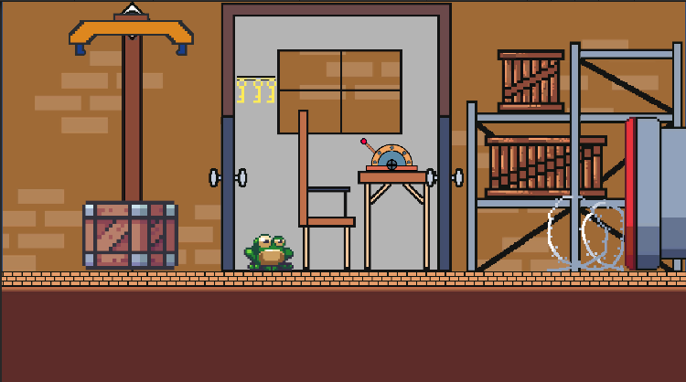
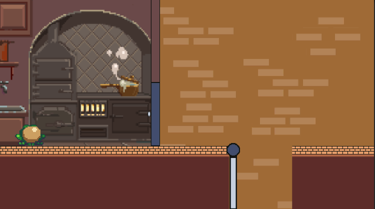
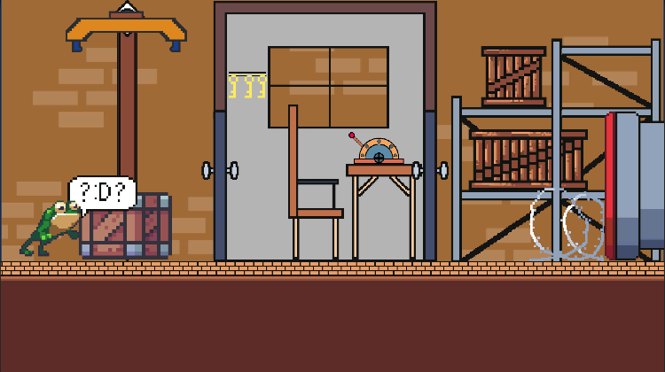
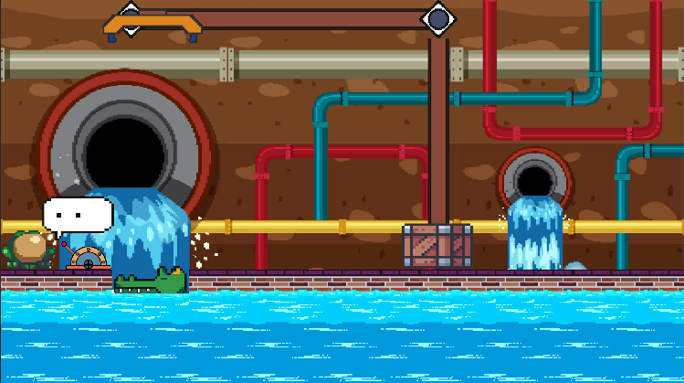
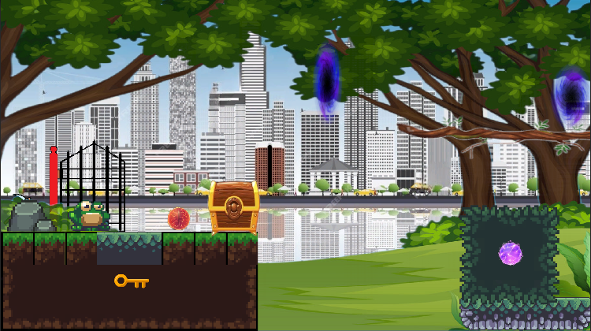

# Save the frog - 2D Unity vector game

This is a personal project aimed at learning and exploring programming techniques such as OOP, Event system, and 2D art design. Featuring engaging puzzle-solving gameplay, you can experience it, with new levels to be updated in the future.  

## Table of Contents

- [Introduction](#introduction)
- [Features](#features)
- [Installation](#installation)
- [Usage](#usage)
- [Other](#other)

## Introduction

This is a puzzle-solving game with multiple different levels featuring various new mechanics. With simple gameplay, your goal is to solve obstacles and help the frog jump to the finish line and advance to the next level.  

## Features

A few levels:
   
 

## Installation

### Prerequisites

Before you begin, ensure you have the following installed:

- Version: Unity 2022.3.4f1  
- Files: you can use command "Git clone https://github.com/tranducthuan220401/2D_Unity_project.git" 

## Usage

To get a local copy up and running follow these simple steps:

1. Add project 
- After preparing everything, simply add the project to Unity Hub and run it.
## Other
- Explore more projects at [here](https://github.com/tranducthuan220401)
